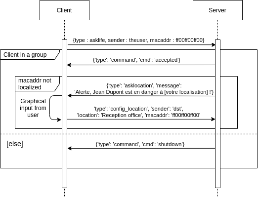
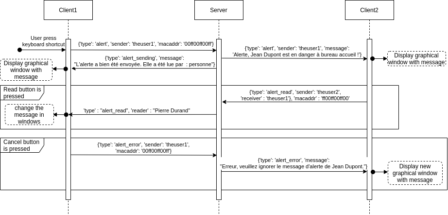

# Kemenn

This is the technical documentation for the server and client fonctionnement.

For the client usage, [see her documentation](https://github.com/Kemenn/clt-kemenn#kemenn-client).

For the server usage, [see also her documentation](https://github.com/Kemenn/srv-kemenn#kemenn-server).

- [DESCRIPTION](#description)
- [SERVER](#server)
- [MESSAGES](#message)

## Description :

### Deployement diagram

### Client :

The client is made in 4 parts :

 - There is a service that **manages the connection** to the alert server. It works in parallel in a completely autonomous way.

 - There is the **shortcut detector**. It listens to the keyboard to detect the double press of the F12 key (by default). When the key has been pressed twice in a row, an alert is sent. It works in parallel in a completely autonomous way.

 - There is the **message manager**. As soon as a message is received, it processes it (answer to the server, display a window with a message, send an alert).

 - There is the **displayer**. It is responsible for displaying a window in a non-blocking way. The window is update by the main thread in the message manager. The displayer depend of it !
 
The **main** file launches the parts one after the other (connection, shortcuts, message manager) by checking that they are correctly started. It also stops them, restarts them if necessary, and notifies the users. It is the conductor.
 
#### Client use case diagram

### Server :

The server is made in 3 parts:

 * **The configuration manager** : it is in charge of reading the configuration and looking for the necessary information to send messages to the clients.

 * **The message handler** : it processes incoming messages and replies to them.

 * **The session manager** : it keeps an updated list of the current sessions of the rds servers. It also keeps the list of correspondence between mac address and username of all clients (thin client or thick client).

 * **The web interface** : is managed by apache.

#### Server use case diagram

## Server

### Files

When kemenn server is started, fonctionnement files are stored in /tmp/kemenn.

| Filename | Fonction |
| :------: | :------- |
| kemenn_started | Contain the PID of main processus of kemenn server |
| command  | * You can write command interpretate by kemenn server |
| out.log  | The standard logs |
| err.log  | The error logs |

*: This file is edited by "kemenn" command ([read doc](https://github.com/Kemenn/srv-kemenn#command-interface)). But you can use it at the hand with the best syntax (see the shell script /usr/bin/kemenn).

The configurations files are stored in */etc/kemenn*. The .ini files is configure by [web interface](https://github.com/Kemenn/srv-kemenn#web-interface). "*kemenn*" file need [configure at the hand](https://github.com/Kemenn/srv-kemenn#configuration), and need restart of kemenn service.

The program files are installed in a very original way in the folder : /usr/share/kemenn.

#### Logs

There is 2 files for logs :
*/tmp/kemenn/out.log* for the standard output, and */tmp/kemenn/err.log* for the errors output.

**Syntax of outgoing messages :**

`r[] '' → messages received (Read)`

`s[] '' → sent message (Send)`

`m[] '' → Information message from the server`

`a[] '' → message sent for Action on clients`

## Message

This part describe the input/output message on server. The input messages come from a client, and output is for client ;)

### Connection from client to kemenn server

### Interaction when there is an alert
The processing done by the server is not shown.

In this diagram, Client1 has the username "theuser1", and the first name "Jean Dupont" ; Client2 has the username "theuser2", and the first name "Pierre Durand".
